# Guia do Usuário — Sistema EBD 3.0

**Versão:** 2.1
**Público-alvo:** Liderança, Superintendentes e Professores da Escola Bíblica Dominical (EBD)

> **Nota de revisão:** alguns comportamentos aqui descritos representam o funcionamento pretendido/planejado das telas. Onde houver divergência entre o que está documentado e o que o sistema exibe em produção, trate como um ponto de atenção para validação de QA.
>
> **Atualização v2.1:** esta revisão incorpora a ativação oficial do módulo de Gestão de Hinos e Escala Semestral (`Cadastros > Hinos`), a integração do hino oficial no fluxo de Encerramento, a padronização de ícones de ação (Editar/Excluir) e as imagens reais das telas — entregas referentes à Issue #29.

---

## 1. Introdução e Visão Geral

Este guia detalha a operação, a estratégia e a governança do Sistema EBD 3.0. O objetivo é garantir que cada funcionalidade seja utilizada em sua plenitude para a gestão de alta performance da Escola Bíblica Dominical.

---

## 2. Acesso ao Sistema

A tela inicial oferece dois caminhos de entrada, de acordo com o perfil do usuário:

- **"Sou professor(a)":** fluxo rápido para registro de chamada dominical — basta selecionar a própria classe em "Escolher classe..." e clicar em "Entrar na chamada".
- **"Superintendência":** acesso administrativo completo, mediante usuário e senha, pelo botão "Entrar no Painel".

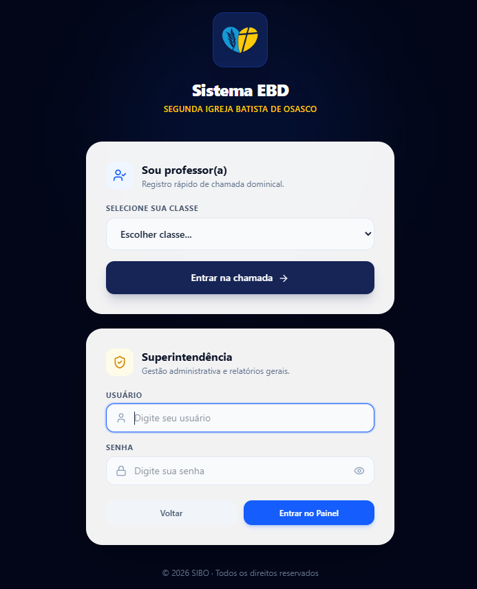
*Tela inicial de acesso, com os fluxos de Professor(a) e Superintendência*

---

## 3. Estrutura do Menu Principal

Após o login como Superintendência, o menu lateral (Sidebar) organiza o sistema em quatro grandes áreas:

- **Dashboard** — painel inicial com indicadores e gráficos em tempo real.
- **Cadastros** — gestão de Alunos, Classes, Superintendentes e Hinos (módulo ativo).
- **Relatórios** — Geral de Alunos, Aniversariantes e Comparativos.
- **Encerramento** — fechamento formal das aulas/chamadas.

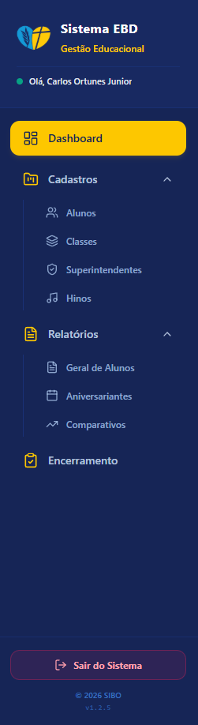
*Menu lateral (Sidebar) completo, com todos os itens expandidos*

---

## 4. O Dashboard: Anatomia dos Indicadores e Gráficos

O Dashboard não é apenas um painel de visualização — é a bússola da superintendência. Ele é dividido em dois blocos: **Cartões de Indicadores** (topo) e **Gráficos de Diagnóstico** (abaixo).

### 4.1 Cartões de Indicadores

- **Alunos Matriculados** — total de alunos cadastrados no sistema (ativos e inativos).
- **Presentes na Última Aula** — quantidade de presenças registradas na chamada mais recente.
- **Visitantes** — total de visitantes registrados no período.
- **Classes Ativas** — número de turmas em funcionamento.
- **Professores** — total de professores cadastrados.
- **Presença Geral (%)** — percentual consolidado de frequência da escola.

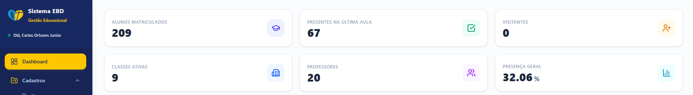
*Linha de cartões de indicadores no topo do Dashboard*

### 4.2 Gráficos de Diagnóstico

- **Frequência por Classe** — gráfico de linha com o percentual de frequência de cada turma (01 a 09).
- **Alunos por Classe** — gráfico de barras com a distribuição quantitativa de alunos por turma.
- **% Presença por Aula** — gráfico de barras com a taxa percentual de assiduidade por aula/turma.
- **Evolução de Frequência** — gráfico de linha temporal com a curva de presenças gerais ao longo das datas.

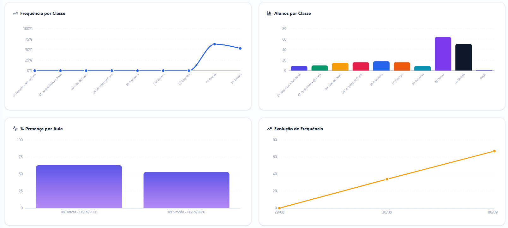
*Os quatro gráficos do Dashboard*

---

## 5. Módulo de Relatórios

### 5.1 Relatório Geral de Alunos

- **Colunas:** Nome do Aluno, Classe, Telefone, Status (Ativo/Inativo).
- **Filtros:** Classe, Tipo de Perfil, Busca por Nome.
- **Botão "Imprimir / Salvar PDF":** gera uma versão pronta para impressão em A4, com cabeçalho institucional.

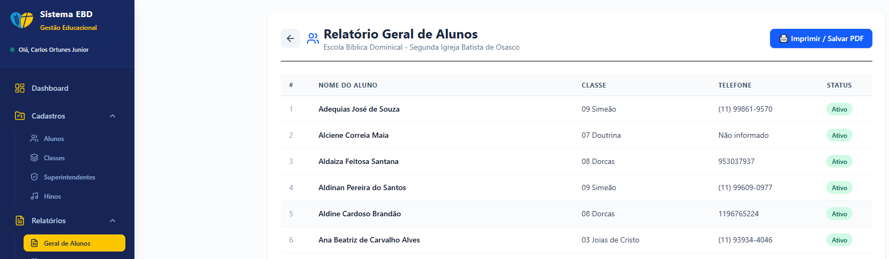
*Tela do Relatório Geral de Alunos, com a listagem e o botão de exportação*

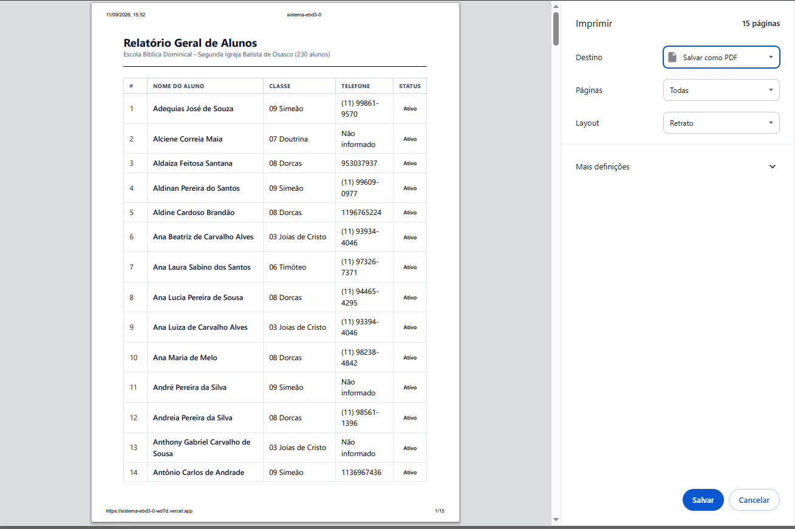
*Pré-visualização de impressão/PDF do Relatório Geral de Alunos*

### 5.2 Relatório de Aniversariantes

Duas abas: **Aniversariantes de Nascimento** e **Aniversariantes de Casamento**.

- **Filtros:** Classe, Mês de referência, checkbox **"Ver Ano Inteiro"**.
- **Colunas:** Nome, Classe, Data de Aniversário, Idade (ou Anos de Casados).
- **Botão "PDF / Imprimir":** layout A4 dedicado, com cabeçalho institucional, linhas zebradas e rodapé paginado.

**Critérios de ordenação:**
- Mês específico → ordenado estritamente pelo dia (1 a 31).
- "Ver Ano Inteiro" → agrupado por mês (Janeiro a Dezembro) e, dentro de cada mês, ordenado pelo dia.

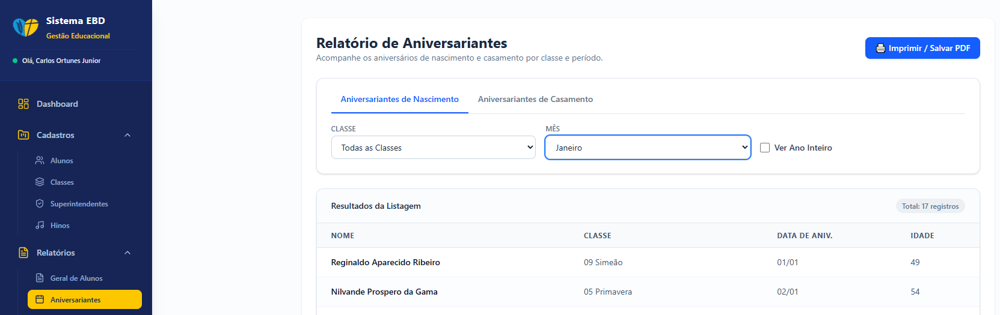
*Relatório de Aniversariantes com um mês específico selecionado (Janeiro)*

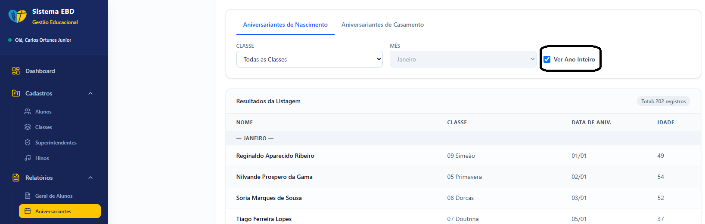
*Relatório de Aniversariantes com "Ver Ano Inteiro" marcado, agrupado por mês*

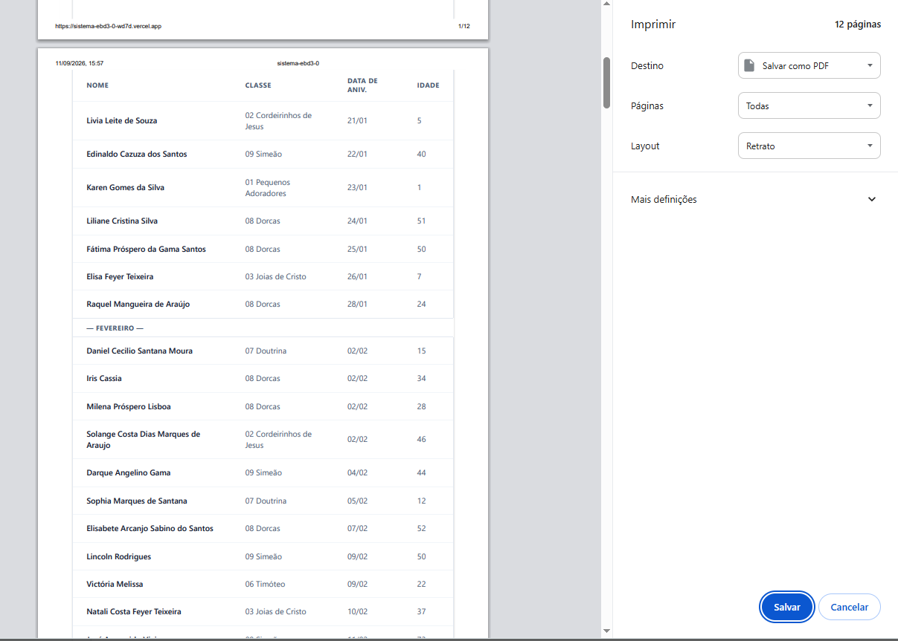
*Pré-visualização de impressão/PDF do Relatório de Aniversariantes*

### 5.3 Comparativos: Inteligência de Dados

Duas visões, controladas pelos botões superiores:

**"Semana a Semana"** (foco nos domingos do mês):
- Gráfico de colunas por turma (01 a 09), cada uma com cor exclusiva; tooltip com nome completo e percentual exato.
- Tabela de Variação Semanal: Presentes, Matriculados, Frequência e "Vs. Domingo Anterior" por domingo.

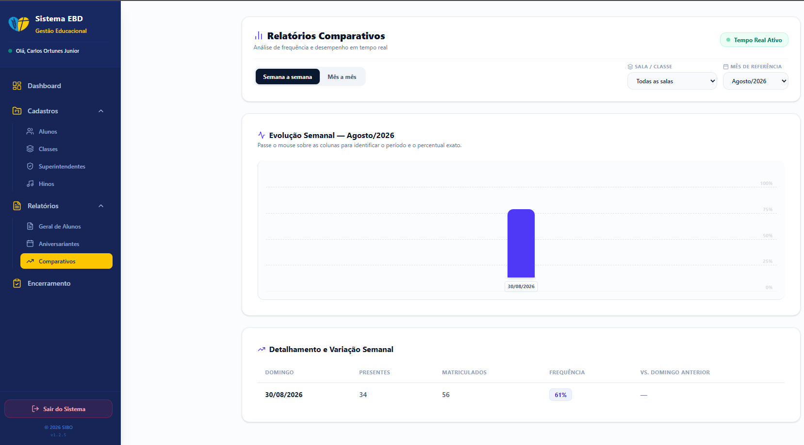
*Comparativos, visão "Semana a Semana"*

**"Mês a Mês"** (foco na tendência de longo prazo):
- Gráfico de colunas mensais, comparando blocos de meses.
- Tabela de Variação Mensal: acumulado histórico por mês.

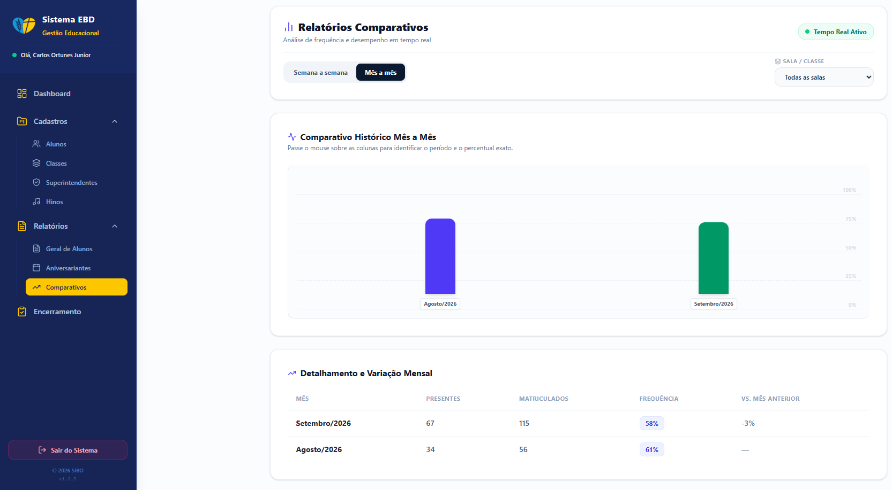
*Comparativos, visão "Mês a Mês"*

**Governança dos filtros:**
- **Sala / Classe:** alterna entre visão consolidada e isolamento de uma turma específica.
- **Mês de Referência:** atualiza instantaneamente gráfico e tabela, em tempo real via Firebase.

---

## 6. Gestão de Cadastros

### 6.1 Alunos: o Ciclo de Vida

1. **Novo Cadastro:** nome completo, data de nascimento e classe inicial.
2. **Manutenção:** ao inativar um aluno, o histórico de presenças passadas é preservado.

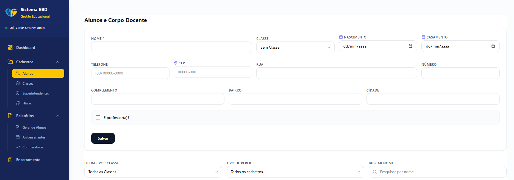
*Formulário de cadastro/edição de aluno*

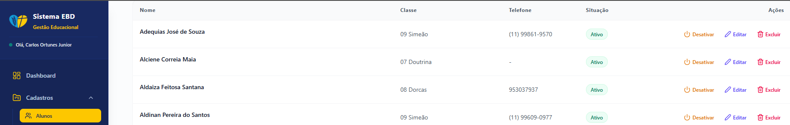
*Listagem de alunos em Cadastros, com ações de Ativar/Desativar*

### 6.2 Classes: Estrutura Escolar

Cada classe precisa estar vinculada a pelo menos um professor, para que ele localize sua turma automaticamente na tela de chamada.

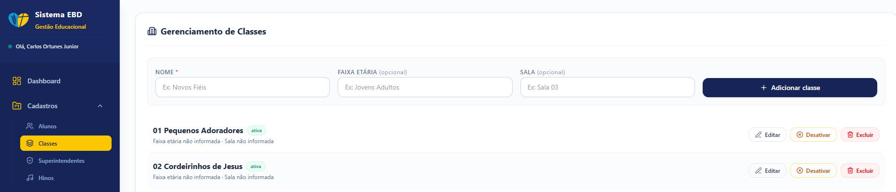
*Tela de gestão de Classes*

### 6.3 Superintendentes

Cadastro dos superintendentes responsáveis pela gestão administrativa da EBD. Cada linha permite Editar, Alterar Senha e Excluir o acesso.

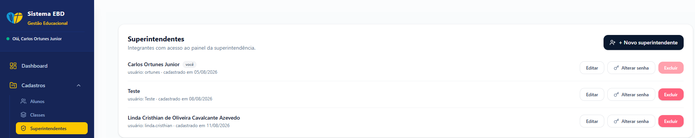
*Tela de Superintendentes*

### 6.4 Hinos e Escala Semestral (módulo ativo)

Módulo "Gestão e Escala de Hinos", acessível em `Cadastros > Hinos`, com duas abas internas:

**Aba "Cadastro de Hinos":**
- Listagem com colunas Número, Título, Hinário/Origem e Ações.
- Botão "+ Novo Hino" adiciona um hino ao repertório institucional.
- Edição e Exclusão com ícones padronizados (Lucide React).

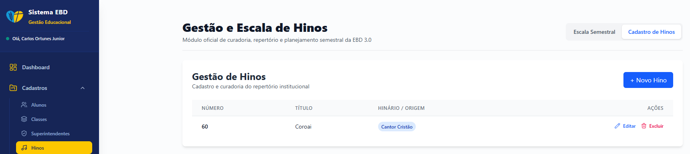
*Aba "Cadastro de Hinos", com listagem e ações de Editar/Excluir*

**Aba "Escala Semestral":**
- Campos "Data do Domingo" e "Selecionar Hino" (a partir do repertório cadastrado).
- Botão "+ Escalar Hino" grava o vínculo entre data e hino.
- Tabela "Domingos Escalados": Data, Número, Título, Hinário e Ações.

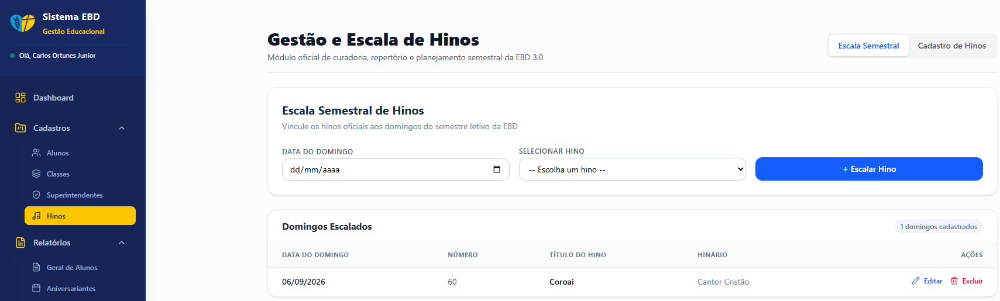
*Aba "Escala Semestral", com o vínculo de hinos aos domingos*

---

## 7. O Encerramento: Fluxo Detalhado e Segurança

- **Sincronização:** ao clicar em "Encerrar Aula", os dados saem do estado "editável" e são movidos para o banco de dados oficial de relatórios.
- **Bloqueio de Edição:** uma vez encerrada (badge "ENCERRADA"), a chamada é bloqueada para o professor.
- **Reabertura:** o botão "Reabrir EBD" permite que um Superintendente com privilégios de auditoria reabra uma aula já encerrada.
- **Integração com Hinos:** a tela exibe o bloco "Hino Oficial do Domingo", trazido automaticamente da Escala Semestral (selo "Validado na Escala"). É possível trocar o hino do dia via "Alterar Hino", ou acessar a "Escala Semestral EBD" diretamente dessa tela.

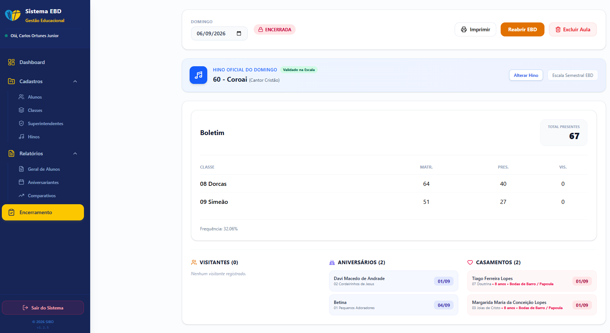
*Tela de Encerramento, com o Hino Oficial do Domingo e o Boletim da aula*

---

## 8. Governança e Acessos

### Por que professores não acessam tudo?

- **Foco Operacional:** o professor se concentra em ministrar a aula e registrar a chamada.
- **Integridade de Dados:** evita alterações estruturais acidentais durante o uso diário.

### Tela Superintendente

Centraliza cadastro, edição, alteração de senha e exclusão de acessos — controle total da EBD para a liderança.

*Gestão de usuários e permissões do Superintendente*

---

## 9. Roadmap: Próximas Funcionalidades

- **Melhorias de estabilidade:** tratamento de exceções e estados de erro nas sincronizações em tempo real, para maior robustez em conexões instáveis.

---

## 10. FAQ de Excelência

**Como corrigir algo após encerrar?**
Apenas um Superintendente com privilégios de auditoria pode reabrir um encerramento, pelo botão "Reabrir EBD".

**A internet caiu?**
O sistema é robusto, mas precisa de sinal para salvar o "encerramento". O cache local mantém o que foi marcado até a reconexão.

**Onde vejo o histórico de um aluno inativado?**
Permanece disponível nos relatórios já encerrados; a inativação apenas remove o aluno das chamadas futuras.

**Como funciona o hino do dia no Encerramento?**
Ele vem automaticamente da Escala Semestral cadastrada em `Cadastros > Hinos`; se não houver hino escalado para a data, é possível selecioná-lo manualmente pelo botão "Alterar Hino".